# Suggested Tips Flow Diagram

```mermaid
flowchart TD
    A([App Start / Splash]) --> B[Load TipSettings from API]
    B --> C{Tips Enabled?\nareTipsEnabled}
    C -- No --> D([Tips Disabled - Skip])
    C -- Yes --> E[Store in Room DB\nTipSettingsEntity +\nSuggestedTipEntity list]

    E --> F([Order Created])
    F --> G[Customer reaches\nPayment Screen]

    G --> H[calculatePercentagesFromDb\nExtensions.kt]
    H --> I{SuggestedTips in DB?}
    I -- Yes --> J[Load from DB\norder, value%, isDefault]
    I -- No --> K[Use Fallback:\n18%, 20%, 22%]
    J --> L[Build TipDisplayItem list\npercentage + calculated amount]
    K --> L

    L --> M{Payment Method}

    M -- Card --> N[PayByCardTipSecondaryScreen\nShow 3 suggested tips\nHighlight default 2nd if none]
    M -- Tender/Cash --> O[PayByTenderTip\nShow 3 suggested tips\n+ Custom Tip option]
    M -- Gift Card --> P[ShowPayByGiftTipScreen\nShow tip options]

    N --> Q{Customer Selection}
    O --> Q
    P --> Q

    Q -- Suggested Tip --> R[onTipSelect callback\ntipAmount passed back]
    Q -- Custom Tip --> S[Numpad Input\nCustom Amount]
    Q -- No Tip --> T[Proceed with\ntipAmount = 0]
    S --> R

    R --> U{Tip > 50%\nof Order Total?\nisGreaterThan50percent}
    U -- Yes --> V[Show Confirmation\nDialog]
    V -- Confirm --> W[isTipAbove50Added = true]
    V -- Cancel --> Q
    U -- No --> W

    W --> X[Total = Order Amount\n+ Tip Amount]
    X --> Y[postPaymentTipEntered\nAnalytics tracked]
    Y --> Z[Payment Request Sent\nwith tipAmount in metadata]
    Z --> AA([Payment Complete])

    %% --- Cash Tips Branch ---
    AA --> BB{Cash Payment?}
    BB -- Yes --> CC[AddTipSelectionDialog\nCash Tips tab]
    CC --> DD[AddTipSelectionCash\nNumpad entry]
    DD --> EE[dashBoardViewModel\n.submitCashTips]
    EE --> FF[POST declared_tips\nto API]
    FF --> GG([Cash Tip Declared])

    %% --- Unclosed Tickets Branch ---
    BB -- Card / Unclosed --> HH{Unclosed Tickets?}
    HH -- Yes --> II[AddTipSelectionDialog\nUnclosed Tickets tab]
    II --> JJ[AddTipSelectionUnclosed\nShow ticket list]
    JJ --> KK[AddTipUnclosedFragment\nAddTipUnclosedNumPadView]
    KK --> LL{Tip > 50%?}
    LL -- Yes --> MM[Show Warning\nisTipAbove50Added flag]
    LL -- No --> NN[updateTipAmount\non Adapter]
    MM --> NN
    NN --> OO([Tip Added to\nUnclosed Ticket])

    %% Styling
    style A fill:#4CAF50,color:#fff
    style D fill:#9E9E9E,color:#fff
    style AA fill:#2196F3,color:#fff
    style GG fill:#2196F3,color:#fff
    style OO fill:#2196F3,color:#fff
    style V fill:#FF9800,color:#fff
    style MM fill:#FF9800,color:#fff
    style K fill:#FF9800,color:#fff
```



## Key Components Reference

| Component | File | Role |
|-----------|------|------|
| `SuggestedTips` | `commons/.../SuggestedTips.kt` | Data model: order, value%, isDefault |
| `TipSettings` | `commons/.../TipSettings.kt` | Config: enabled, customTipEnabled, list |
| `TipDisplayItem` | `commons/.../TipDisplayItem.kt` | UI model: calculated amount + percentage |
| `calculatePercentagesFromDb()` | `Extensions.kt:3599` | Builds TipDisplayItem list from DB |
| `PayByCardTipSecondaryScreen` | `ui/secondaryScreens/` | Card payment tip selection UI |
| `PayByTenderTip` | `ui/secondaryScreens/` | Tender/cash tip selection UI |
| `AddTipSelectionDialog` | `utils/addtiplater/` | Post-payment tip management |
| `AddTipUnclosedFragment` | `ui/main/fragments/` | Tip on unclosed tickets |
| `TipSettingsEntity` | `commons/.../TipsSettingsEntity.kt` | Room DB persistence |

## Flow Summary

1. **Config** — TipSettings loaded from API at startup, stored in Room DB
2. **Calculation** — `calculatePercentagesFromDb()` builds 3 tip options (DB values or 18/20/22% fallback)
3. **Selection** — Secondary screen shows suggested tips with calculated dollar amounts; default pre-highlighted
4. **Validation** — Tips >50% of order require explicit confirmation
5. **Payment** — Tip added to total, analytics fired, included in payment request
6. **Post-Payment** — Cash tips declared via numpad; unclosed ticket tips added via `AddTipSelectionDialog`
```
