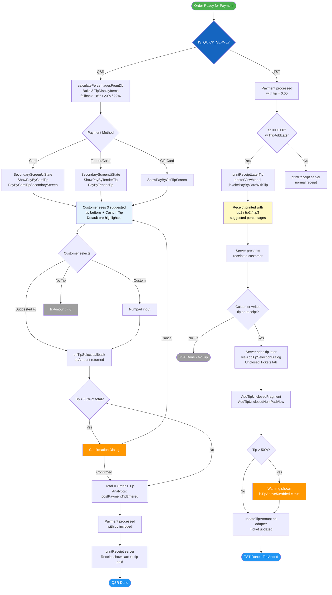

# Suggested Tips Flow — QSR vs TST



## Difference at a Glance

| | QSR | TST |
|---|---|---|
| **When tips shown** | On secondary screen during payment | On printed receipt after payment |
| **Who selects tip** | Customer (at POS screen) | Customer (handwritten on receipt) |
| **Tip in payment request** | Included immediately | `willTipAddLater = true`, added later |
| **Receipt print call** | `printReceipt("server")` | `printReceiptLaterTip()` |
| **Receipt content** | Actual tip amount paid | Suggested tip % lines (tip1/tip2/tip3) |
| **Post-payment tip entry** | Not needed | `AddTipUnclosedFragment` via dialog |
| **Key flag** | `IS_QUICK_SERVE = true` | `IS_QUICK_SERVE = false` |

## Key Files

| File | Line | Role |
|------|------|------|
| `Constants.kt` | 89 | `IS_QUICK_SERVE` flag |
| `PayByCardFragment.kt` | 1461 | QSR: trigger `ShowPayByCardTip` secondary screen |
| `PayByCardFragment.kt` | 1794 | TST: set `willTipAddLater` flag |
| `PayByCardFragment.kt` | 614 | Branch: `printReceiptLaterTip()` vs `printReceipt()` |
| `Extensions.kt` | 3599 | `calculatePercentagesFromDb()` — builds tip options |
| `PayByCardTipSecondaryScreen.kt` | — | QSR card tip selection UI |
| `PayByTenderTip.kt` | — | QSR tender tip selection UI |
| `PrinterTemplates.kt` | 2034 | `printServerTips()`, tip receipt lines |
| `AddTipUnclosedFragment.kt` | — | TST: add tip to unclosed ticket |
```
